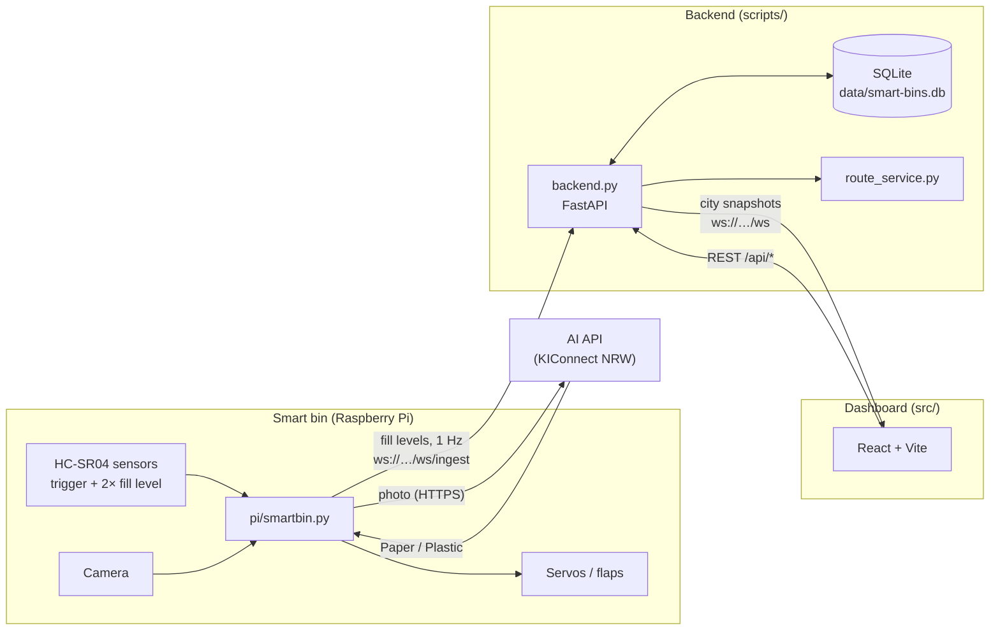

# Smart Waste Management Dashboard - Cologne

React + Vite dashboard with a Python, FastAPI and SQLite backend for a city-wide smart waste bin prototype. The app connects to the local server and visualizes multiple smart waste sorting bins across Cologne, Germany.

Each simulated bin has Trash, Recycling, and Compost compartments, live fill levels, a map location, operational status, and route planning support.

## Architecture

Three components that talk over two WebSockets and one REST API:



The Pi does two independent jobs: classifying waste with the camera and the AI
API, and reporting how full its bins are. Only the second one talks to the
dashboard. Bins without hardware are simulated by the backend.

## Features

- Responsive navigation with Overview, Smart Bins, Route Planning and Settings pages
- Persistent bin data and measurements in SQLite
- REST API for adding, deleting and inspecting bins
- Live city-wide WebSocket snapshot stream, pushed on every data change and at least every 30 seconds
- Device ingest WebSocket for real Raspberry Pi bins reporting their fill level once per second
- Cologne map using OpenStreetMap tiles through Leaflet
- 20 simulated smart bin locations around Cologne
- Threshold filter for collection planning
- Summary cards for total bins, full bins, almost-full bins, average fill, and connection status
- Sortable smart bin table and individual detail views
- Backend route generation with a nearest-neighbor heuristic
- Multi-part Google Maps export for generated collection routes
- Custom collection route start points
- Reusable map, address search and manual coordinate location picker
- Demo settings for pausing updates and resetting all fill levels
- Straight-line Haversine distance estimate for the MVP route

## Environment

Create `.env.local` in the project root when you want to override the default city WebSocket URL:

```env
VITE_SMART_BIN_CITY_URL=ws://localhost:8181/ws
VITE_SMART_BIN_API_URL=/api
```

If the file is missing, the frontend defaults to `ws://localhost:8181/ws` and `/api`.

## Run The Demo

Install frontend and backend dependencies:

```bash
npm install
pip install -r requirements.txt
```

Start the backend and simulator:

```bash
npm run mock-server
```

The server provides REST endpoints and a WebSocket on port `8181`. Optional CLI arguments are:

```bash
npm run mock-server -- 8181 cologne-smart-bin-mock
```

Start the frontend in another terminal:

```bash
npm run dev
```

Open the Vite URL shown in the terminal, usually `http://localhost:5173`.

## Mock Data

`scripts/backend.py` sends a city-wide frame whenever the data changes and, through the simulation loop, at least every 30 seconds. Every frame contains:

- `city: "Cologne"`
- `device_group_id`
- `timestamp_ms`
- `bins`

Note that a connected Raspberry Pi reports once per second, and every accepted device frame triggers a snapshot broadcast - so with real hardware attached the dashboard receives roughly one frame per second rather than one every 30 seconds.

The mock server simulates 20 stable locations around Cologne, including Koelner Dom, Koeln Hauptbahnhof, University of Cologne, Rheinauhafen, Neumarkt, Heumarkt, Stadtgarten, Deutz, Ehrenfeld, Nippes, Muelheim, Poller Wiesen, and Rheinpark.

Fill levels change only slightly during each update. Bin data, current fill levels and measurement history are stored in `data/smart-bins.db`.

## Real Hardware

### Bill of materials

Everything needed for one physical bin. The GPIO pins for each part are in [`pi/readme.md`](pi/readme.md).

| Qty | Part | Notes |
|---|---|---|
| 1 | Raspberry Pi with Raspberry Pi OS (Bookworm or newer) | needs `picamera2` / `rpicam-still` for the CSI camera path |
| 3 | HC-SR04 ultrasonic sensor | 1× trigger at the front, 2× fill level in the bin lids |
| 3 | Voltage divider, e.g. 1 kΩ + 2 kΩ resistor | **required** - the HC-SR04 ECHO pin outputs 5 V, the Pi GPIO is 3.3 V only |
| 1 | SG92R micro servo | Paper flap |
| 1 | SG90 micro servo | Plastic flap |
| 1 | SBC-OLED01 128×64 I2C display (address 0x3C) | optional - the program runs without it |
| 1 | Camera | either a CSI camera on the Pi, or a phone running the "IP Webcam" app (see `CAMERA_URL`) |
| 1 | 5 V power supply for the servos | driving both servos from the Pi's 5 V rail can brown it out |
| - | Jumper wires, screws | |
| - | 3D printed housing and mounts | STL files and print settings in [`printables/readme.md`](printables/readme.md) |

An account for the KIConnect NRW AI API is needed for the waste classification (`KICONNECT_API_KEY`, see [`pi/env.example`](pi/env.example)). Fill-level reporting works without it.

### Reporting protocol

A Raspberry Pi bin (`pi/smartbin.py`) reports its measured fill levels to the backend through a second WebSocket, `ws://<host>:8181/ws/ingest`. Each frame names the bin and one or more compartments:

```json
{
  "bin_id": "CGN-001",
  "timestamp_ms": 1737045000000,
  "compartments": {
    "recycling": { "fill_level_percent": 41.9, "distance_cm": 34.9 },
    "trash": { "fill_level_percent": 88.4, "distance_cm": 12.6 }
  }
}
```

The backend validates the frame, writes it to the database and broadcasts the updated city snapshot to every dashboard right away. Compartments that are not part of the frame keep their value. As long as a device is connected, its bin is excluded from the simulation, so real and simulated bins can run side by side. Device history is thinned to one entry per 30 seconds instead of one per frame.

The exclusion works per bin, not per compartment. The Pi has fill-level sensors for two compartments only (`recycling` and `trash`), so the `compost` value of a live bin keeps whatever it had before the device connected and no longer moves - the dashboard currently shows it like any other value. Keep that in mind when reading a live bin's compost level or its overall status.

Set `SMART_BIN_INGEST_TOKEN` on the backend to require the same token as a `?token=` query parameter on the ingest socket. If the variable is unset, the socket is open, which is fine for a local demo.

Wiring, GPIO pins, calibration and the Pi setup are documented in [`pi/readme.md`](pi/readme.md).

Address search uses the public OpenStreetMap Nominatim service only when a search is submitted. Search requests are limited to one per second and biased towards Cologne.

## Threshold And Routes

The dashboard defaults to an 80% collection threshold. Move the “Include bins from fill level” slider to include bins where at least one compartment is greater than or equal to the selected value.

Click “Generate collection route” to build a route from the fixed Waste Collection Depot. The current route optimizer:

- starts at the depot
- visits the nearest unvisited included bin
- continues until every included bin is visited
- returns to the depot
- estimates total distance with the Haversine formula

This is an MVP approximation with straight-line distances. It does not call a paid API and does not need API keys. The route service can later be replaced with OSRM, OpenRouteService, Google Maps, or another routing engine.

## Notes

- Python 3.10 or newer is required for the backend.
- The Raspberry Pi reports real fill levels; all other bins stay simulated.
- Dashboard user authentication is intentionally out of scope for this prototype.
